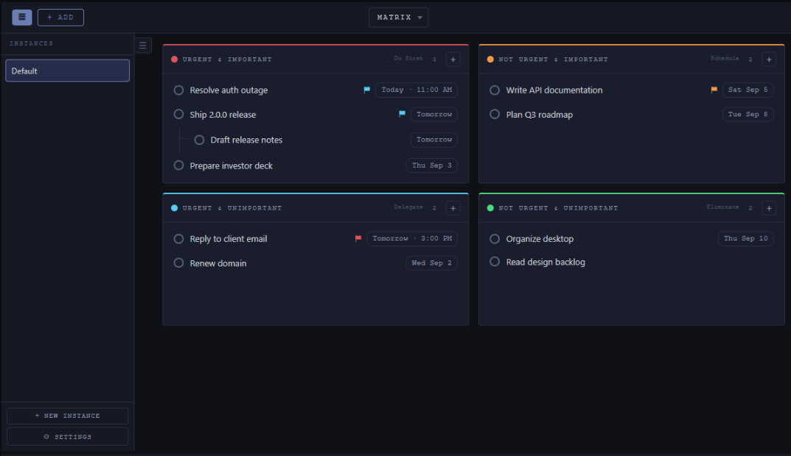
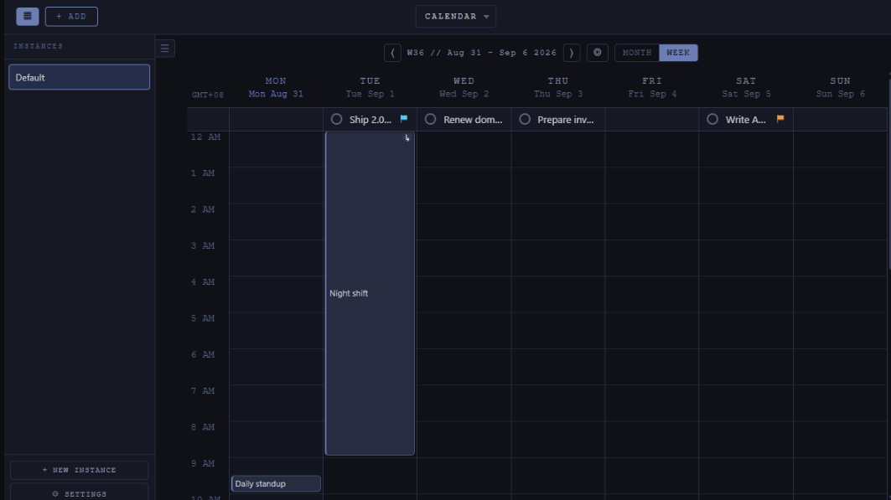
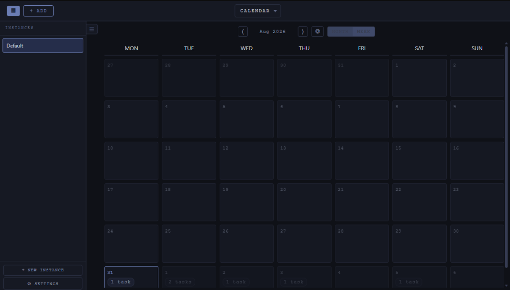
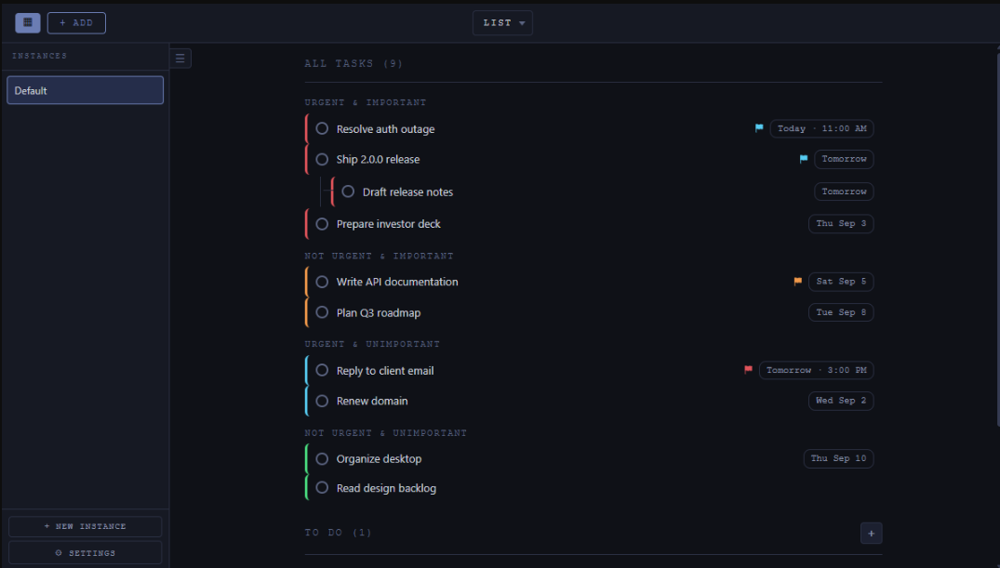
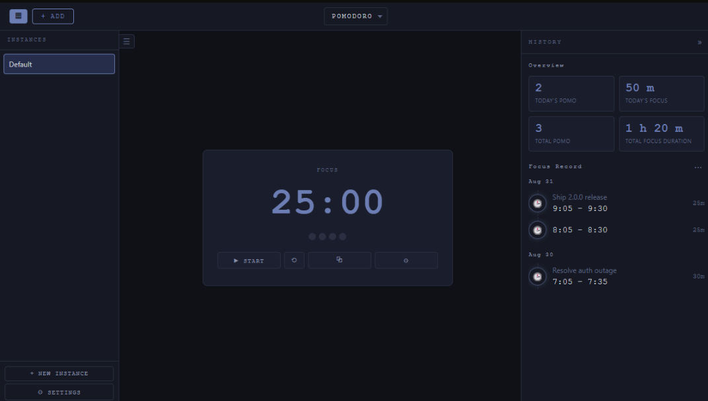
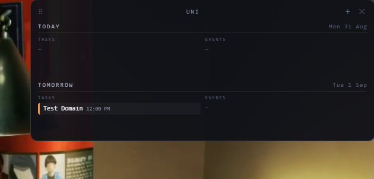
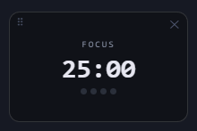

# Butime

butime is an offline time-management desktop app built with Electron; I made this application for my special and important person. It combines an Eisenhower matrix, a month and week calendar, a task list, to-do items, and a Pomodoro timer in one local, dependency-free application. All data is stored locally.

> [!NOTE]
> AI-Assisted Side project
> Parts of this project, especially the front end were developed with an assistance of AI tools. AI was mainly used as development aid/search engine for ideas, automation on tests(insertion of JSON data), automation of documentation(MDs), and suggestions. The code, markdowns, and design were still reviewed, tested manually, and implemented by me.

## Screenshots

<h3 align="center">Matrix</h3>

<p align="center"></p>

<h3 align="center">Calendar</h3>

<p align="center"></p>

<p align="center"></p>

<h3 align="center">List</h3>

<p align="center"></p>

<h3 align="center">Pomodoro</h3>

<p align="center"></p>

<h3 align="center">Widgets</h3>

<h4 align="center">Task/Event Widget</h4>

<p align="center"></p>

<h4 align="center">Pomodoro widget</h4>

<p align="center"></p>


## Features

- **Eisenhower matrix**- prioritise tasks by urgent and important, with subtasks, pinning, priorities, and custom colours.
- **Calendar**- month and week views. The week view is a Google-Calendar-style timeline with drag-to-create events and automatic overlap nesting.
- **Overnight events**- an event that crosses midnight (for example 7:30 PM to 9:00 AM the next day) is split across the two days with a continuation marker.
- **Task list**- a flat, quadrant-sorted list of all tasks, with a separate events section.
- **To-do items**- plain checklist items with no deadline or metadata.
- **Colour categories**- named colour presets that apply to tasks and events; renaming or recolouring a category updates every item that uses it.
- **Pomodoro timer**- focus and break sessions, a collapsible history with stats, and a floating always-on-top timer window.
- **Desktop widget**- a Today and Tomorrow widget showing tasks and events, colour-coded and read-only. Multiple widgets can be added per instance.
- **Instances**- keep separate datasets for different projects or contexts.
- **System tray**- the app minimises to the tray and can start automatically at sign-in.
- **Export / import**- full backup and restore of all instances and settings as JSON.

## Usage

The header dropdown switches between the main views: **MATRIX**, **CALENDAR**, **LIST**, and **POMODORO**. The sidebar lists your instances and holds the settings button. Right-click a task or event to open its context menu (date, priority, type, colour, and actions); right-click or drag inside a calendar day to create a new entry.

## Data & Backup

Everything is stored locally on your machine. Use **SETTINGS > EXPORT JSON** to download a backup of all instances and settings, and **IMPORT JSON** to restore one.

## Built With

- [Electron](https://www.electronjs.org/)
- JavaScript no framework

## Dev

### Prerequisites

- [Node.js](https://nodejs.org/) (includes npm)

### Install

```bash
npm install
```

### Run in development

```bash
npm start
```

### Build a Windows installer

```bash
npm run dist
```

The installer is written to `dist/`.

## License

Released under the [GPL-3.0](LICENSE) license. Author: Yaspartame.
